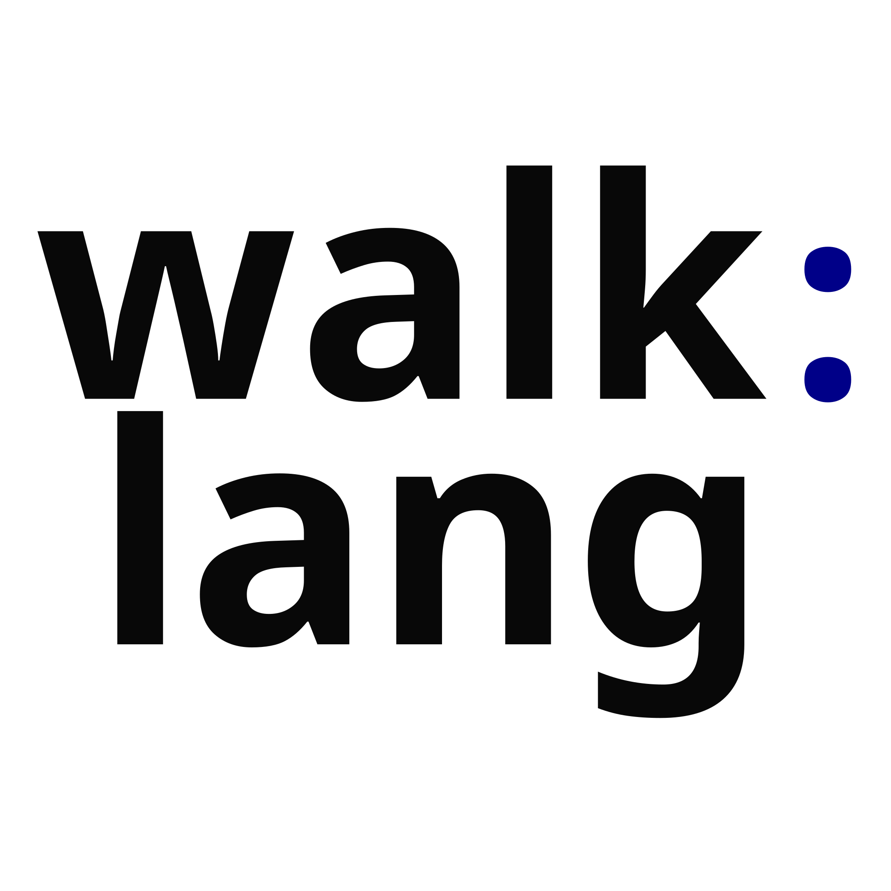

# WalkLang



[Getting started] | [Learn] | [Documentation] | [Contributing]

This is the main source code repository for WalkLang. It contains the compiler,
standard library surface, editor tooling, documentation, examples, tests, and
release automation.

WalkLang compiles `.walk` source through generated C into native executables:

```text
.walk source -> Go compiler -> generated C -> native executable
```

[Getting started]: docs/INSTALL.md
[Learn]: docs/README.md
[Documentation]: docs/README.md
[Contributing]: CONTRIBUTING.md

## Why WalkLang?

- **Predictability:** indentation-based syntax, explicit module boundaries, and
  a stable v1 language contract keep programs easy to read and reason about.
- **Native output:** WalkLang emits understandable C, then uses the system C
  compiler to build native executables.
- **Tooling:** project mode, tests, formatting, diagnostics, package workflows,
  editor support, API docs generation, and release scripts are part of the repo.

## Quick Start

Read [the install guide][Getting started], then build a small project:

```bash
scripts/install-local.sh v5-local
walk init hello
cd hello
walk check
walk build
./build/hello
walk test
```

## Installing From Source

If you want to install from this repository, see [INSTALL.md](docs/INSTALL.md).

## Getting Help

Start with the docs index at [docs/README.md](docs/README.md). The planned
hosted docs path is <https://walklang.wlkrlabs.com/docs>. Until public community
channels exist, use this repository's issue tracker for bugs and design
questions.

## Contributing

See [CONTRIBUTING.md](CONTRIBUTING.md).

For a project overview and implementation direction, see
[ARCHITECTURE.md](docs/ARCHITECTURE.md), [ROADMAP.md](docs/ROADMAP.md), and
[STATUS.md](docs/STATUS.md).

## License

WalkLang source code is distributed under the terms of the Apache License 2.0.

See [LICENSE](LICENSE) for details.

## Trademark

The WalkLang name, logo, and brand identity are protected project marks owned by
Shane Walker / WLKRLABS.

If you want to use the WalkLang name, logo, or brand identity, read
[TRADEMARKS.md](TRADEMARKS.md).
